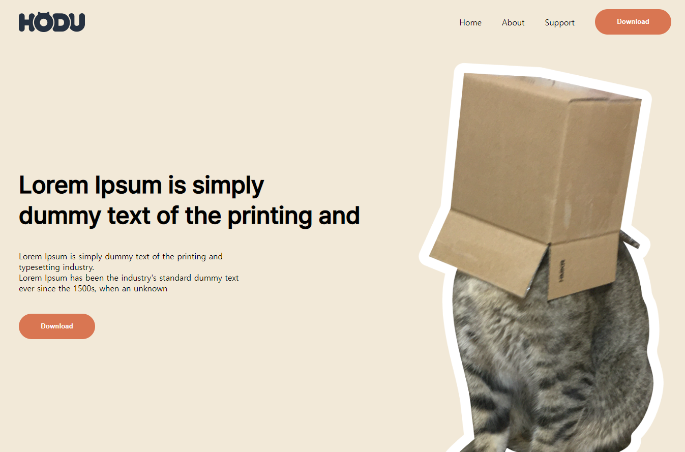

# 프로젝트 이름

Ormi5_FrontEnd_Project
link: https://little6523.github.io/Ormi5_FrontEnd_Project/Front_End_Project_LHJ.html 

   
  
   

## 프로젝트 소개

주제: HODU 랜딩 페이지 제작

목적: FE관련 기본 기술 함양 및 프로젝트 경험 쌓기

 

## 기술 스택

|  HTML   |  CSS3   | JavaScript |  
|:-------:|:-------:|:----------:|
| ![html] | ![css3] |   ![js]    |

 

## 구현 기능

### 기능 1 HTML, CSS를 이용한 레이아웃 구현

### 기능 2 Show more 버튼을 누르면 추가적인 이미지 렌더링

### 기능 3 kakao map api를 이용한 지도 구현

### 기능 4 Subscribe 버튼 클릭시 모달창 출력

 

## 배운 점 & 아쉬운 점

### 배운 점

1. HTML, CSS3, JavaScript 관련 자료들을 열심히 찾아보면서 공부한 덕분에
FE의 기본 기술들을 어느 정도 잘 사용할 수 있게된 것 같다.

2. 다음 프로젝트 때는 div태그를 남발하지 않게 레이아웃을 잘 설계해봐야 겠다는 생각이 크게 들었다.

### 아쉬운 점

1. CSS속성을 레이아웃을 생각안하고 너무 이 속성 넣어보고 저 속성 넣어보면서 끼워맞추기식? 으로 구현했는데,
   그러다보니 반응형 웹을 만들기가 상당히 난감했다... 다음에는 레이아웃부터 CSS까지 생각하면서 코드를 작성
   해야겠다.

2. div태그는 사용을 지양해야하는데, 코드를 편하게 작성하려고 불필요한 div 태그를 작성한 것 같다.

 

## 라이센스

MIT &copy; [NoHack](mailto:lbjp114@gmail.com)

<!-- Stack Icon Refernces -->

[html]: /images/stack/html.svg

[css3]: /images/stack/css.svg

[js]: /images/stack/javascript.svg
